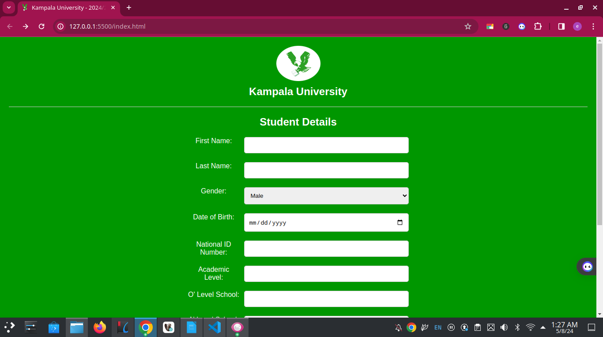

# Student Registration Form

Welcome to the Student Registration Form project! This application provides a user-friendly form for capturing student details, including personal information and academic history. It features input fields for first name, last name, gender, date of birth, national ID number, academic level, O' level school, A' level school, district of birth, phone contact, and email address.

## Screenshot

## Installation

To install the project, follow these steps:

1. Clone the repository: `git clone <repository-url>`
2. Open the `index.html` file in your web browser.

## Usage

Fill out the form with the required student details. Click the "Submit" button to submit the form data. You can also click the "Reset" button to clear all fields and start over.

## Author

This project is crafted by KALUNGI JOSHUA EDWARD, a skilled MERN stack developer dedicated to enhancing user experiences through innovative solutions.

- **Email:** [joshuakalungi101@gmail.com](mailto:joshuakalungi101@gmail.com)
- **Phone:** [+256758518110]
- **Workstation:** [Criokk Designs]
- **Position:** [Junior Software Developer]

For inquiries, collaborations, or further information, feel free to reach out. Let's build something amazing together!

## License

This project is licensed under the MIT License.
