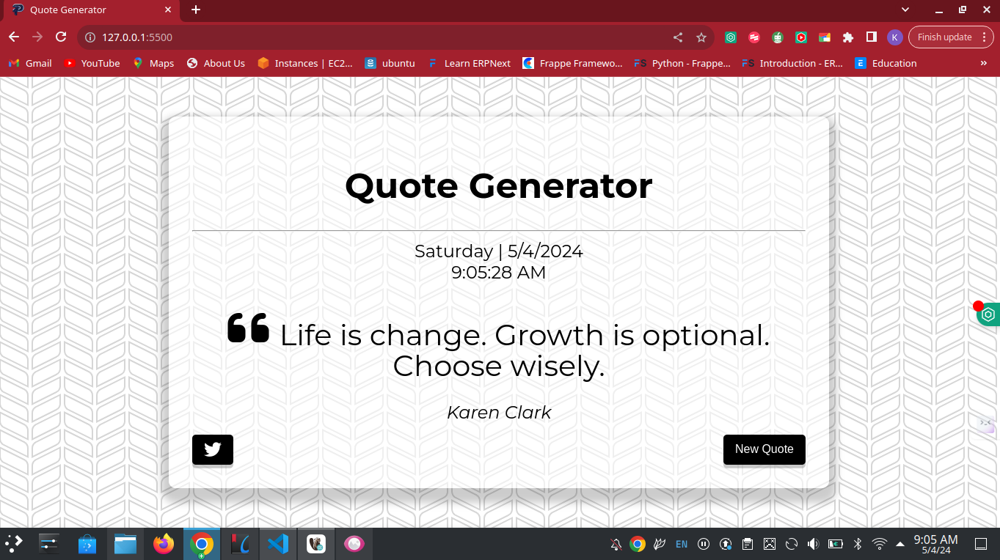

# Javascript Quote generator with fetch async function

Welcome to the Javascript Quote generator with fetch async functionality! This Js application showcases a user-friendly quote generator integrated with a convenient date and time feature and a tweet this button for efficient posting to a twitter account.

This project is a simple Js application that demonstrates the use of fetch async functions with apis.

## Screenshot

## Installation

To install the project, follow these steps:

1. Clone the repository: `git clone <repository-url>`
2. Start the application by clicking on: `Go live` for visual studio users.

## Usage

Click the new quote button to generator random quotes after which you can post directly to your twitter/X account. The current date and time will be displayed.

## Author

This project is crafted by KALUNGI JOSHUA EDWARD, a skilled MERN stack developer dedicated to enhancing user experiences through innovative solutions.

- **Email:** [joshuakalungi101@gmail.com](mailto:joshuakalungi101@gmail.com)
- **Phone:** [+256758518110]
- **Workstation:** [Criokk Designs]
- **Position:** [Junior Software Developer]

For inquiries, collaborations, or further information, feel free to reach out. Let's build something amazing together!

## License

This project is licensed under the MIT License.